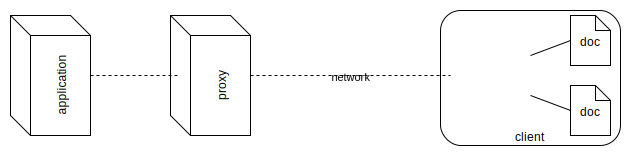
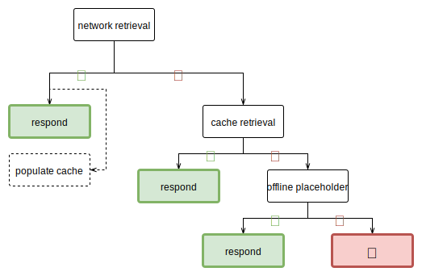
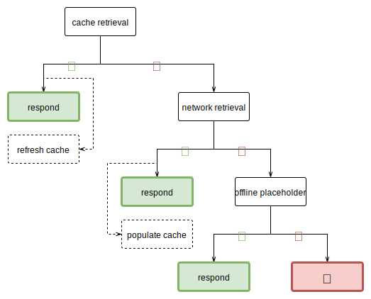

Progressive Web Apps
====================

explicitly a
[marketing term](https://fberriman.com/2017/06/26/naming-progressive-web-apps/),
thus somewhat vaguely defined

basic requirements:

* web app manifest
* service worker for offline functionality
* served via HTTPS, due to security implications (see [below](#service-worker))
  and as an HTTPS-everywhere carrot (along with various other modern browser APIs)

[Service Worker](https://github.com/w3c/ServiceWorker/issues/705)
-----------------------------------------------------------------

persistent background process  
→ like web workers, but document-independent life cycle

essentially constitutes a separate appliction  
→ sidecar-style:

once spawned, all local HTTP requests are routed through this application  
⇒ local, programmable¹ proxy  
⇒ security implications, thus HTTPS only (with the exception of
  <http://localhost>)  
NB: origin scoping means foreign assets (i.e. cross-origin requests) are treated
    as opaque responses

additional ([potential](https://jakearchibald.github.io/isserviceworkerready/)?)
features:

* push notifications
* background sync
* ¯\\\_(ツ)_/¯

service worker initially spawned (and later updated) via web page's JavaScript –
but otherwise document-independent (e.g. different global scope, no DOM access)  
NB: application described by a separate JavaScript file

Request Strategies
------------------

as per adactio's [book](https://abookapart.com/products/going-offline)
and [blog post](https://adactio.com/journal/13540):

* for HTML files, try the network first (while caching in the background), using
  cache as fallback – plus generic offline placeholder page in case the
  respective page was not cached
* for other files, try the cache first, using network as fallback – optionally
  refreshing cache in the background
* these strategies might also be selected based on other factors, e.g. URI-based
  routing (application-specific)

----

¹ cf. [Extensible Web Manifesto](https://github.com/extensibleweb/manifesto):
  low-level building blocks – Service Worker supersedes declarative Application
  Cache, which proved insufficiently flexible (indeed, problematic) due to
  premature assumptions
